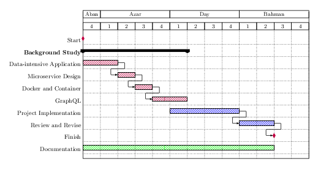

<!--
*** Thanks for checking out the Best-README-Template. If you have a suggestion
*** that would make this better, please fork the repo and create a pull request
*** or simply open an issue with the tag "enhancement".
*** Don't forget to give the project a star!
*** Thanks again! Now go create something AMAZING! :D
-->

<!-- PROJECT SHIELDS -->
<!--
*** I'm using markdown "reference style" links for readability.
*** Reference links are enclosed in brackets [ ] instead of parentheses ( ).
*** See the bottom of this document for the declaration of the reference variables
*** for contributors-url, forks-url, etc. This is an optional, concise syntax you may use.
*** https://www.markdownguide.org/basic-syntax/#reference-style-links
-->

  

  <h3 align="center">Trending Technologies in Data-intensive Application Development</h3>
  

    Bachelor Thesis
     
  

<!-- TABLE OF CONTENTS -->

  
📗 <b>Table of Contents</b>

  <ol>
    <li>
      <a href="#-about-the-project"> About The Project</a>
    </li>
    <li>
      <a href="#-objectives"> Objectives</a>
    </li>
    <li>
      <a href="#-plan-timeline"> Plan Timeline</a>
    </li>
    <li>
      <a href="#-documentation"> Documentation</a>
    </li>
    <li><a href="#-implementation">Implementation</a></li>
  </ol>

<!-- ABOUT THE PROJECT -->
## 🔰 About The Project
Data-intensive applications are those in which data is the primary challenge, whether in terms of **quantity**, **complexity**, or **speed of change**. In this project, first, we state the **main concerns** in data-intensive applications. Then we will touch upon the **architecture** and some **trending technologies** used in such software systems, comparing them to their predecessors.

(<a href="#top">back to top</a>)

## 🚀 Objectives
- Defining data-intensive applications and its challenges
- Comparing microservices and monolithic architecture
- Comparing containerization and virtualization
- Comparing GraphQL APIs and REST APIs
- Showcasing these technologies in a sample implementation 

(<a href="#top">back to top</a>)

## 📅 Plan Timeline 

- **Aban**, **Azar**, **Day** and **Bahman** are months in Persian calendar
- duration: 11 weeks + 2 extra weeks 

(<a href="#top">back to top</a>)

## 📕 Documentation
- Documentation in Persian: [Documentation](./doc.pdf)
- Presentation Slides: [Slides](./slides.pdf)

(<a href="#top">back to top</a>)

## ⚡ Implementation
- You can find the implementation in: [Shwitter](https://github.com/CyberKatze/shwitter)

(<a href="#top">back to top</a>)

### Author
- [Mehrdad Shahidi](https://github.com/CyberKatze)
